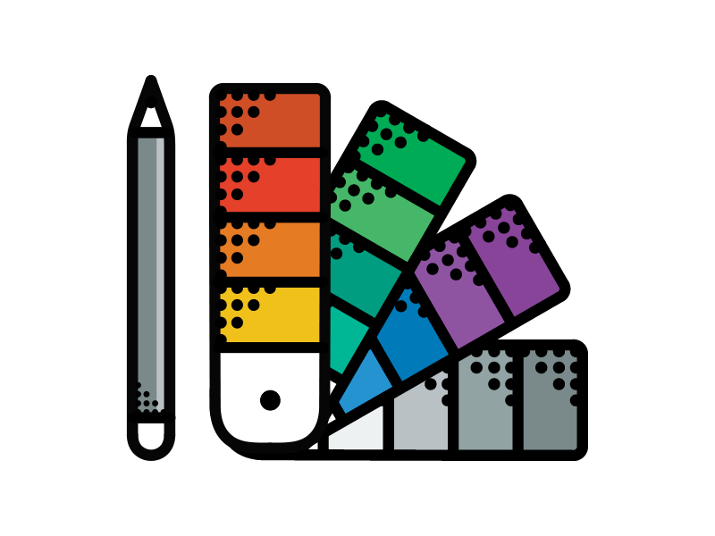

	

# Colorful 
__A curated list of awesome resources to choose your next color scheme.__  
Inspired by the __[awesome](https://github.com/sindresorhus/awesome)__ list. Please read the __[contribution guidelines](contributing.md)__ before contributing.

## Table of Contents
- [Tools](#tools)
  - [Libraries](#libraries) 
  - [Web App](#web-app)
- [Color Palettes](#color-palettes)
- [Articles](#articles)  

## Tools

#### Libraries
- [Chroma.js](http://gka.github.io/chroma.js/) - JavaScript library for dealing with colors.
- [GradStop.js](https://github.com/Siddharth11/gradStop.js) - Generate gradient color stops.
- [Colorable](http://jxnblk.com/colorable/) - Color palette combination contrast tester.
- [Adaptive Backgrounds](https://briangonzalez.github.io/jquery.adaptive-backgrounds.js/) - Extract dominant colors from images and apply to its parent (jQuery Plugin).
- [Coloor](https://github.com/krasimir/coloor) - Image preloading utility.
- [Color Thief](https://github.com/lokesh/color-thief) - Grab color palette from an image.
- [Colorify.js](https://github.com/LukyVj/Colorify.js) - Simple, customizable, tiny JavaScript color extractor.
- [Colofilter.css](https://github.com/LukyVj/colofilter.css) - Duotone filters made with CSS.

#### Web App
- [Color Picker for Data](http://tristen.ca/hcl-picker/) - Hold chroma constant and pick your palette with ease.
- [Colorbrewer2](http://colorbrewer2.org/) - Multi-hue and single-hue palettes for heat maps and data visualization.
- [Coolors](https://coolors.co/) - Generate infinite color palettes for your designs and share.
- [Flat UI Colors](http://flatuicolors.com/) - UI color set.
- [Material Design Colors](http://www.materialui.co/) -  Material Design Colors, Flat UI Colors and Material Design Icons.
- [Palettab](http://palettab.com/) - New color palette and font inspiration with every tab (Chrome Extension).
- [Paletton](http://paletton.com) - The Color Scheme Designer.
- [Pictaculous](http://www.pictaculous.com/) - Generate color palette with an image.
- [Adobe Color Wheel](https://color.adobe.com/) - Create color schemes with the color wheel.
- [Drag Gradients](http://elrumordelaluz.github.io/draGGradients/) - Generate and customize multiple css3 radial gradients.
- [SassMe](http://sassme.arc90.com/) - Visualize SASS color functions in real-time without compiling.
- [Shade](http://jxnblk.com/shade/) - Mathematically derived gradient explorer.
- [Colourco](http://www.colourco.de/) - Easily and intuitively combine colours.
- [HSL Color Picker](http://hslpicker.com/) - HSL Color Picker.
- [SVG Color Filter Playground](http://kazzkiq.github.io/svg-color-filter/) - Understand how feColorMatrix works.
- [Random A11y](http://www.randoma11y.com) - Generates a random palette that is a11y friendly.

## Color Palettes
- [ColorHunt](http://colorhunt.co/) - Color palettes with quick preview feature.
- [COLOURlovers](http://www.colourlovers.com/) - Tools to create color palettes as well as pattern designs.
- [Swiss Style Color Picker](http://www.swisscolors.net/) - Color palettes collection.
- [UI Gradients](http://uigradients.com/) - Handpicked collection of beautiful colour gradients.
- [Color Hex Palettes](http://www.color-hex.com/color-palettes/) - Discover the new color palettes.
- [Color Palettes](http://colorpalettes.net/) - Decorate your house, flat, bedroom, kitchen, living room and wedding with color ideas.
- [Design Seeds](http://www.design-seeds.com/) - Colors found in nature and the aesthetic of purposeful living.
- [Gradients](http://thewebrocks.com/demos/gradientsio/v2.html) - Curated gradients.
- [Colour Names](http://colours.neilorangepeel.com/) - List of colour names in CSS.
- [LOL Colors](http://www.lolcolors.com/palettes/popular) - Curated color palette inspiration.
- [BrandColors](http://brandcolors.net/) - Official color codes for the world's biggest brands.
- [Color Lisa](http://www.colorlisa.com/) - Color palette masterpieces of the world’s greatest artists.

## Articles
- [Finding the Right Color Palettes for Data Visualizations](https://blog.graphiq.com/finding-the-right-color-palettes-for-data-visualizations-fcd4e707a283#.k1zjxtfet)
- [Trendy Web Color Palettes and Material Design Color Schemes & Tools](http://www.awwwards.com/trendy-web-color-palettes-and-material-design-color-schemes-tools.html?utm_source=Twitter&utm_medium=Social&utm_campaign=Twitter-Blog-Color&utm_content=Twitter)
- [How I Work with Color](https://medium.com/@JustinMezzell/how-i-work-with-color-8439c98ae5ed#.b99s3au3w)
- [Color Palette Documentation for Living Style Guides](https://medium.com/@jxnblk/color-palette-documentation-for-living-style-guides-d25d65aa20a5#.q0q6fb5qy)
- [How I Learned About Color Mixing](https://medium.com/@julialundman/my-experiences-in-learning-about-color-6de4ec274503#.m0t57e6ws)
- [The (Unfinished) Basics of Colour](https://medium.com/life-tips/the-unfinished-basics-of-colour-292858f62e62#.b1z1ejmsg)
- [The Power of Colour in App Design](https://medium.com/@nicknelo/why-use-colour-branding-in-apps-a95deba49dae#.pj3012j9x)
- [Create Emotion With Color In UX Design](https://uxplanet.org/create-emotion-with-color-in-ux-design-446a3766b085#.g6o0xsyfd)
- [How to Design for Color Blindness](https://medium.com/@usabilla/how-to-design-for-color-blindness-62d4d8ae9f6a#.uujosqblu)
- [The Principles of UX Choreography](https://medium.com/@becca_u/the-principles-of-ux-choreography-69c91c2cbc2a#.henp1zpjb)
- [How to create a color story](https://medium.com/design-story/how-to-create-a-color-story-aa75a62bf953#.pclx97jsf)
- [The Psychology of Color in Marketing](https://medium.com/@gregoryciotti/the-psychology-of-color-in-marketing-74f9b00834a2#.midcws85u)
- [Algorithm for automatic harmonious color selection for the image](https://uxplanet.org/algorithm-for-automatic-harmonious-color-selection-for-the-image-fc26dde69ca1#.5luiehaag)
- [Oiling the Color Wheel with Jade + Sass](https://journal.helabs.com/oiling-the-color-wheel-with-jade-sass-5688ceada87c#.frc7e0rj5)
- [Take color inspiration from the masters](https://medium.com/@WebdesignerDepot/take-color-inspiration-from-the-masters-e9c2bcf1c8e2#.bhc22yxap)
- [Build a Color Scheme: The Fundamentals](http://tympanus.net/codrops/2012/09/17/build-a-color-scheme-the-fundamentals/)
- [Principles of Color and the Color Wheel](http://tympanus.net/codrops/2012/02/28/principles-of-color-and-the-color-wheel/)
- [Color and Emotion: What Does Each Hue Mean?](http://tympanus.net/codrops/2012/04/03/color-and-emotion-what-does-each-hue-mean/)
- [Color Theory for Designers, Part 1: The Meaning of Color](https://www.smashingmagazine.com/2010/01/color-theory-for-designers-part-1-the-meaning-of-color/)
- [A Simple Web Developer’s Guide To Color](https://www.smashingmagazine.com/2016/04/web-developer-guide-color/)
- [Design Accessibly, See Differently: Color Contrast Tips And Tools](https://www.smashingmagazine.com/2014/10/color-contrast-tips-and-tools-for-accessibility/)
- [The Code Side Of Color](https://www.smashingmagazine.com/2012/10/the-code-side-of-color/)
- [How to create the right emotions with color in web design](http://thenextweb.com/dd/2015/04/07/how-to-create-the-right-emotions-with-color-in-web-design/)
- [Introduction to Color Theory](http://www.tigercolor.com/color-lab/color-theory/color-theory-intro.htm)
- [Picking a color for your brand](http://focuslabllc.com/digest/picking-a-color-for-your-brand)
- [Finessing \`feColorMatrix\`](http://alistapart.com/article/finessing-fecolormatrix)
- [Designing in color](https://medium.freecodecamp.com/designing-in-color-abd358660a7b)
- [Color Realism and Color Science](http://web.mit.edu/abyrne/www/ColorRealism.html)

## License
  
This work is licensed under a [Creative Commons Attribution 4.0 International License](http://creativecommons.org/licenses/by/4.0/).  
Image credits - [Aleksandar Savić](https://dribbble.com/almigor) and [Nenad Zivanovic](https://dribbble.com/nenadzivanovic).
